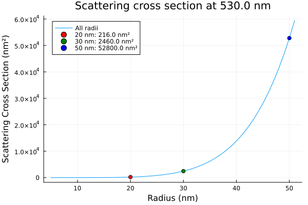

# Plasmonics Package
This is a work in progress of a plasmonics package, right now it works with the quasi-static approximation and calculates the scattering cross-section of gold nanoparticles following the refractive index data of [Johnson and Christy][1] for gold on the CSV file.
### Description
So far the program works as follows:
-   There is an AuData module that reads the csv and calculates, and extrapolates, the real and imaginary part of the dielectric permitivity.
-   Then, the module polar_qs uses this extrapolation to calculate the polarizability of the nanoparticle given the wavelength of excitation.
-   Lastly, the Cscat file is the main file where we declare the global physical constants, particle parameters and excitation wavelength, then we define the radii range that we want to study and proceed to use the polarizability function to calculate the scattering cross-section and plot the graphs.
-   It also has a function to highlight specific radii and add the results to a legend within the plot.

### Short-term to do
- [ ] Add a mie scattering polarizability and scattering cross-section calculation.
- [ ] Add a selector for each case of validity between the quasi-static approximation and Mie theory.
- [ ]  Add a calculation for multiwavelength sweep for a fixed particle size.

### Long-term to do
- Study the interaction of eletric fields $\vec{E} = Ae^{i\omega t}$and nanoparticles to visualize the plasmon and the scattered electric field $|\vec{E}|^2$

### Examples
Plot of the cross-scattering section for different radii of gold nanoparticles at an excitation wavelength of 530 nm and highlighted radii of interest.

### References
[1]: P. B. Johnson and R. W. Christy. Optical constants of the noble metals. Phys. Rev. B 6, 4370-4379 (1972).